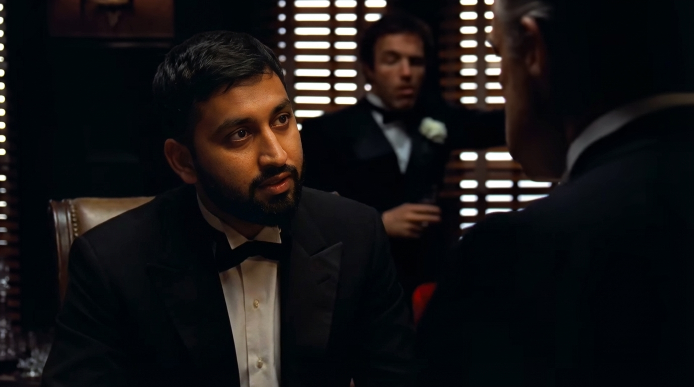
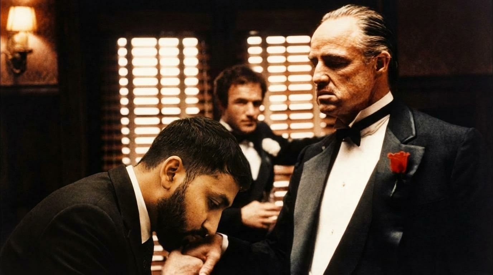

# GemCinema 📽️ 
Recreate movie scenes with Gemini 3 Pro Image (Nano Banana Pro) and Veo 3.1.

## Run the Web App:

1. Clone the repository on your local machine.
2. Navigate to `cd GemCinema` directory.
3. Run `pip install -r requirements.txt` to install the packages.
4. Open `.env` file and configure your Gemini API key.
5. Run `flask run` to start the server.
6. Open `localhost:5000` on your web browser and enjoy converting your sketches into beautiful paintings.

---

## Architecture

---

## Results

### AI-Generated Storyboard (Gemini 3 Pro)
*The images below demonstrate the identity merge where the user's portrait is integrated into original movie frames with matched lighting, grain, and era-specific styling.*

  
  

### Final Cinematic Premiere (Veo 3.1)
*The final render takes the edited stills as reference images to generate a consistent, high-definition video sequence with natural motion and stable facial identity.*

  <a href="https://www.youtube.com/watch?v=U2xOqgkG1RM" style="text-decoration: none; color: inherit;">
    
    Watch on YouTube
  </a>

---

# Acknowledgment:

This project was developed as part of Google's AI Developer Programs AI Sprint H2 2025. My sincere thanks to the AI Developers Program Team for their generous support in providing GCP credits to help facilitate this project.
